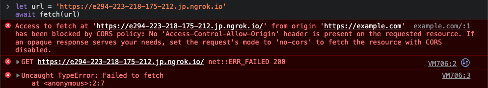
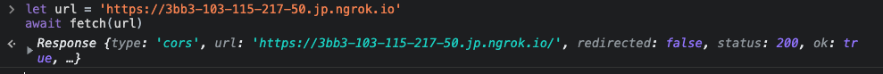
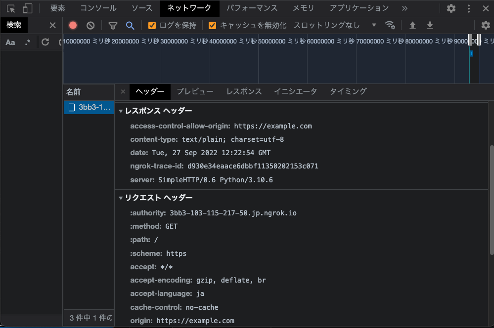
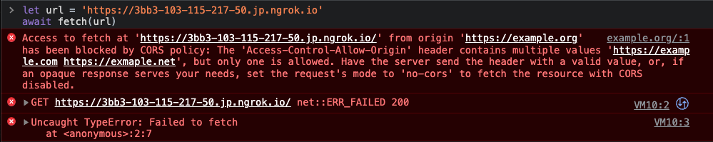
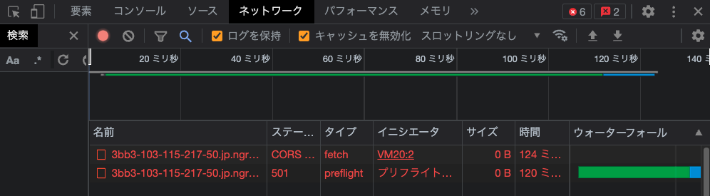
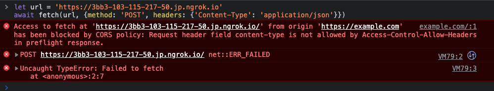

# CORSハンズオン

## 0. 読者へ

このハンズオンでは、ブラウザにおけるCORSの挙動をサーバとなるPythonコードをいじりながら理解していくことを目的としています。
CORSについてざっくりとした説明しかしないため、より詳細を知りたい方はMDNの[オリジン間リソース共有 (CORS)](https://developer.mozilla.org/ja/docs/Web/HTTP/CORS)を参照することをお奨めします。

このハンズオンではブラウザがGoogle Chromeであることを想定します。

誤植や追記、内容の訂正など、どんなPRも歓迎しています。
説明文に一次情報を添えて変更を下さると嬉しいです。

## 1. CORSの種類

まずは、手を動かす前にCORSの種類についてみてみます。

Cross-Origin Resource Sharing (CORS) とは、ブラウザ上で動作するスクリプトが、異なるオリジンのリソースをやり取りできるようにするためのプロトコルです。
オリジンというのは、URL構造のうち、スキーム+ホスト+ポートのことを指します[Origin (オリジン)](https://developer.mozilla.org/ja/docs/Glossary/Origin)を参照してください。

```text
https://example.com:8080/index.html
|------||---------||---||---------|
 Scheme     Host   Port    Path
|----------------------|
        Origin
```

CORSは、リクエストの条件によって次のどちらかの動作をします。

- 単純リクエスト(Simple Requests)
- プリフライトリクエスト(Preflight requests)

以下の両方の条件を満たすと単純リクエストとなり、満たさないとプリフライトリクエストとなります。

|条件|項目|
|---|---|
|メソッドが以下の中に含まれる|<ul><li>`GET`</li><li>`HEAD`</li><li>`POST`</li></ul>|
|独自で設定するヘッダーが以下の中に含まれる|<ul><li>`Accept`</li><li>`Accept-Language`</li><li>`Content-Length`</li><li>`Content-Type`(以下の値のみ)<ul><li>`application/x-www-form-urlencoded`</li><li>`multipart/form-data`</li><li>` text/plain`</li></ul></ul>|

さて、説明はここまでで手を動かしてみましょう。

## 2. 単純リクエストハンズオン

単純リクエスト(Simple Request)では、ブラウザから外部のオリジンへのリクエストを呼び出すことでデータのやり取りが行われます。


このリクエストがどうなっているかを、ローカルでサーバを立てつつブラウザからリクエストを送信して調べてみましょう。

まず、以下のコードを`srv.py`として保存します。

```python
from http.server import HTTPServer, SimpleHTTPRequestHandler

class CORSRequestHandler(SimpleHTTPRequestHandler):
    def do_GET(self):
        self.send_response(200)
        self.end_headers()
        self.wfile.write(b'Hello CORS!')
        return

httpd = HTTPServer(('localhost', 8003), CORSRequestHandler)
httpd.serve_forever()
```

保存したら、コンソールから`python3 srv.py`を実行して、サーバを起動します。
まずは動作確認として、そのまま`http://localhost:8003`をブラウザで開いてみましょう。
`Hello CORS!` が表示されれば動作確認完了です。


次に、ブラウザで`https://example.com`(`http`でなく`https`なことに注意)を開き、デベロッパーツールを開きます。
そのまま以下のコードを、デベロッパーツールに入れて実行しましょう。

```javascript
let url = 'http://localhost:8003'
await fetch(url)
```


いよいよ初めてのCORSリクエストです。結果はどうなるでしょうか？



なんと！初めてのリクエストは失敗に終わってしまいました！落ち着いてエラーメッセージを読んでみましょう。

> オリジン 'https://example.com' からの 'http://localhost:8003/' でのfetchへのアクセスは、CORS ポリシーによってブロックされました。要求されたリソースに 'Access-Control-Allow-Origin' ヘッダーが存在しません。opaque responseが必要な場合は、リクエストのmodeに'no-cors'を設定して、CORSを無効にしてリソースをフェッチしてください。

何やらレスポンスに`Access-Control-Allow-Origin`ヘッダーがないため`fetch`へのアクセスがブロックされたとあります。

（`fetch`メソッドにおいて'no-cors'を設定したopaque responseは、リクエストが失敗したときに空のレスポンスを返すことを意味します。
詳しくはMDNの[Fetch API](https://developer.mozilla.org/ja/docs/Web/API/Fetch_API)を参照してください。）

サーバのログを見ると、サーバ側では正常にリクエストが処理されたようです。

```console
127.0.0.1 - - [10/Aug/2022 11:45:14] "GET / HTTP/1.1" 200 -
```

デベロッパーツールのNetworkタブを見るとリクエスト・レスポンスにどのようなヘッダーがあったかを見ることができます。


確かに、レスポンスには`Access-Control-Allow-Origin`がありません。
MDNでは[`Access-Control-Allow-Origin`](https://developer.mozilla.org/ja/docs/Web/HTTP/Headers/Access-Control-Allow-Origin)が、以下のように説明されます。

> `Access-Control-Allow-Origin`レスポンスヘッダーは、指定されたオリジンからのリクエストを行うコードでレスポンスが共有できるかどうかを示します。

指定されたオリジンというのは、`Origin`リクエストヘッダーの値のことです。
画像の例では`https://example.com`ページを開き、外部オリジンの`http://localhost:8003`にリクエストを送信するときに、`Origin`ヘッダーの値は`https://example.com`となっております。
詳しくは[Origin (オリジン)](https://developer.mozilla.org/ja/docs/Glossary/Origin)を参照してください。

それでは、サーバに`Access-Control-Allow-Origin`ヘッダーを追加する処理を記述してみましょう。

```diff
     def do_GET(self):
         self.send_response(200)
+        self.send_header('Access-Control-Allow-Origin', '*')
         self.end_headers()
         self.wfile.write(b'Hello CORS!')
         return
```

`*`（ワイルドカード）というのは`Origin`リクエストヘッダーがどのような値であったとしても、ブラウザ側でブロックしなくて良いことを示しています。

修正が完了してサーバを再起動したら、先ほどと同様に`fetch`メソッドを呼び出してみましょう。

```javascript
let url = 'http://localhost:8003'
await fetch(url)
```


初めてのCORSに成功しました！以下のコードで再度実行すれば中身を取り出すこともできます。

```javascript
await (await fetch(url)).text()
```


## 3. アクセスを許可するオリジン

`Access-Control-Allow-Origin`レスポンスヘッダーに`*`を設定し、任意のオリジンからのリクエストを許可していました。この章では、オリジンによってアクセスの許可を出し分けてみましょう。

サーバ側で許可するオリジンであった場合には、`Origin`リクエストヘッダーの値を`Access-Control-Allow-Origin`に設定して返します。

では、サーバ側で許可しないオリジンであった場合はどうすると良いでしょうか？
実は、この時の動作は[Cross-Origin Resource Sharing W3C Recommendation 16 January 2014 supserseded 2 June 2020](https://www.w3.org/TR/2020/SPSD-cors-20200602/)及び[The Web Origin Concept](https://datatracker.ietf.org/doc/html/rfc6454)で定義されません。

[What is the expected response to an invalid CORS request?](https://stackoverflow.com/questions/14015118/what-is-the-expected-response-to-an-invalid-cors-request)にあるように、動作には2つの派閥があるようです。

- サーバ側でCORSヘッダーを検査し、レスポンスにエラー（4xx）を返す
- レスポンスは正常に返し、クライアントにCORSヘッダーを検査させる

このハンズオンでは、後者の選択の方針で進めます。
また、`Access-Control-Allow-Origin`レスポンスヘッダーには、許可されるオリジンのリスト（スペース区切り）を設定して返すこととします。
この実装は実際にデバッグの際に役立ちますが、副作用を伴うリクエストのレスポンスには向いていません。
また、なんらかの理由でオリジンのリストを公開したくない場合にも使えません。
その場合には、単に`Access-Control-Allow-Origin`レスポンスヘッダーを設定しないべきでしょう。

<!--
他の実装の選択肢としては、`Access-Control-Allow-Origin`レスポンスヘッダーをそもそも返さないなどが考えられますが、この方法はCORSを使用するWeb開発者がエラーに気づきにくいデメリットがあります。

ハンズオンとしては、こちらの方針としてもいいかもしれない。
-->

想定する動作は次のようになります。


想定する動作に従って`srv.py`に変更を加えます。

```diff
class CORSRequestHandler(SimpleHTTPRequestHandler):
+    valid_origins = ['https://example.com', 'https://exmaple.net']
+
+    def is_valid_origin(self, origin):
+        return origin in self.valid_origins
+
     def do_GET(self):
         self.send_response(200)
-        self.send_header('Access-Control-Allow-Origin', '*')
+        origin = self.headers['Origin']
+        acao = origin if self.is_valid_origin(origin) else ' '.join(self.valid_origins)
+        self.send_header('Access-Control-Allow-Origin', acao)
         self.end_headers()
         self.wfile.write(b'Hello CORS!')
         return
```

`Origin`リクエストヘッダーで送信された値が`valid_origins`リストに入っている場合、`Access-Control-Allow-Origin`レスポンスヘッダーにその値を設定します。
入っていない場合は、`Access-Control-Allow-Origin`レスポンスヘッダーに`valid_origins`の値を` `（スペース）区切りで連結した値を設定します。

修正が完了したら、忘れずにサーバを再起動し、`https://example.com`を開いて、コンソールから以下を実行します。

```javascript
let url = 'http://localhost:8003'
await fetch(url)
```



`fetch`メソッドの実行は成功します。

Networkタブを見てみると`Origin`リクエストヘッダーの値と`Access-Control-Allow-Origin`レスポンスヘッダーの値が一致していることが確認できます。



次に、許可されてないオリジンからリクエストを送信してみます。`https://example.org`を開いて、同じようにコンソールで以下のコードを実行します。

```javascript
let url = 'http://localhost:8003'
await fetch(url)
```



> オリジン 'https://example.org' からの 'http://localhost:8003/' での fetch へのアクセスは、CORS ポリシーによってブロックされました。Access-Control-Allow-Origin ヘッダーに複数の値 'https://example.com https://exmaple.net' が含まれていますが、許可されるのは1つだけです。サーバーに有効な値のヘッダーを送信させるか、不透明な応答が必要な場合は、要求のモードを 'no-cors' に設定して、CORSを無効にしてリソースをフェッチしてください。

`fetch`メソッドの実行は失敗します。
エラーメッセージには、`Access-Control-Allow-Origin`ヘッダーに複数のオリジンが含まれているとあります。

実際に、Networkタブをみると`Access-Control-Allow-Origin`レスポンスヘッダーには複数のオリジン`https://example.com https://exmaple.net`が含まれていることが確認できます。


[Cross-Origin Resource Sharing - 5.1 Access-Control-Allow-Origin Response Header](https://www.w3.org/TR/2020/SPSD-cors-20200602/#access-control-allow-origin-response-header) では  `origin-list-or-null`が定義されていますが、`Note`に以下のような記述があります。

> 実際には、origin-list-or-null実装はより制約されています。スペースで区切られたオリジンのリストを許可するのではなく、単一のオリジンまたは文字列 "null" のどちらかを指定します。

多くのブラウザでは単一のオリジンしか許容しないようになっています。

### 3.a 不正な単一オリジン

このハンズオンでは、不正なオリジンを伴うリクエストがきた時に、複数の正しいオリジンのリストを返すよう実装しました。
補足として、単一の正しいオリジンを返すようにした場合の結果を以下に示します。


> オリジン 'https://example.org' からの 'http://localhost:8003/' でのフェッチへのアクセスは、CORS ポリシーによってブロックされました。'Access-Control-Allow-Origin' ヘッダーの値 'https://example.com' は指定されたオリジンと同じではありません。サーバーに有効な値のヘッダーを送信させるか、不透明な応答が必要な場合は、要求のモードを 'no-cors' に設定して、CORS を無効にしてリソースをフェッチしてください。

## 4. プリフライトリクエストハンズオン

これまでは、単純リクエストでの例を試してきました。
本章では、プリフライトリクエストでの例を試してみましょう。


CORSをプリフライトリクエストとして実行するために、JSONをPOSTで送信する例を考えます。
POSTによるJSONの送信では、 `Content-Type: application/json` ヘッダーを設定することで、単純リクエストになる条件から外れ、プリフライトリクエストになります。
単純リクエスト/プリフライトリクエストの条件については、[1. CORSの種類](#1-corsの種類)の表を参照してください。

```javascript
let url = 'http://localhost:8003'
await fetch(url, {method: 'POST', headers: {'Content-Type': 'application/json'}, body:{}})
```

POSTによる送信を受け付けられるようにし、重複した処理を関数に切り出します。

```diff
     def is_valid_origin(self, origin):
         return origin in self.valid_origins

-    def do_GET(self):
+    def send_acao(self):
         origin = self.headers['Origin']
         acao = origin if self.is_valid_origin(origin) else ' '.join(self.valid_origins)
         self.send_header('Access-Control-Allow-Origin', acao)
+        return
+
+    def do_GET(self):
+        self.send_response(200)
+        self.send_acao()
         self.end_headers()
         self.wfile.write(b'Hello CORS!')
         return

+    def do_POST(self):
+        self.send_response(201)
+        self.send_acao()
+        self.end_headers()
+        self.wfile.write(b'Nice POST!')
+        return
+
```

修正した `srv.py` を起動し直し、 `https://example.com` （正しいオリジン）から `fetch` によるPOSTを実行します。
結果は次のようになりました。


> オリジン 'https://example.com' からの 'http://localhost:8003/' でのfetchへのアクセスは、CORS ポリシーによってブロックされました。プリフライトリクエストへのレスポンスがアクセス制御チェックを通過しません。要求されたリソースに 'Access-Control-Allow-Origin' ヘッダーが存在しません。不透明な応答が必要な場合は、要求のモードを'no-cors'に設定して、CORS を無効にしてリソースをフェッチします。

プリフライトリクエストのアクセス制御チェックを通過できなかったとあります。
また、NetworkタブやサーバのログからOPTIONSメソッドによるリクエストが送信され、ステータスコード501(Not Implemented Error)が返っていることが確認できます。
POSTメソッドのリクエストは発生せずに、OPTIONSメソッドのリクエストが発生してしまっています。どういうことでしょうか？



```console
$ python3 srv.py
127.0.0.1 - - [10/Aug/2022 11:45:14] code 501, message Unsupported method ('OPTIONS')
127.0.0.1 - - [10/Aug/2022 11:45:14] "OPTIONS / HTTP/1.1" 501 -
```

プリフライトリクエストの場合、実際のPOSTリクエストなどが発生する前に、OPTIONSメソッドによるリクエスト/レスポンスが発生し、CORSポリシーによる検証が行われます。
この検証が通った場合のみブラウザは実際のPOSTリクエストを実行します。

それではサーバでOPTIONSメソッドを受け付けるコードを追加しましょう。

```diff
class CORSRequestHandler(SimpleHTTPRequestHandler):
+     def do_OPTIONS(self):
+        self.send_acao()
+        self.end_headers()
+        return
+
```

`srv.py` を起動し直して、再度実行してみます。

```javascript
let url = 'http://localhost:8003'
await fetch(url, {method: 'POST', headers: {'Content-Type': 'application/json'}, body:{}})
```



> オリジン 'https://example.com' からの 'http://localhost:8003/' での fetch へのアクセスは、CORS ポリシーによってブロックされました。リクエストヘッダーフィールドの content-type は、プリフライトレスポンスの Access-Control-Allow-Headers によって許可されていません。

またもやリクエストは失敗してしました。
エラーメッセージには`content-type`リクエストヘッダーが `Access-Control-Allow-Headers`によって許可されていないとあります（HTTPヘッダーはcase-insensitive（大文字・小文字を区別しない）なので、`Contnet-Type`と`content-type`表記のどちらでもよい）。
MDNでは[`Access-Control-Allow-Headers`](https://developer.mozilla.org/ja/docs/Web/HTTP/Headers/Access-Control-Allow-Headers)が、以下のように説明されます。

> `Access-Control-Allow-Headers` レスポンスヘッダーは、 `Access-Control-Request-Headers` を含むプリフライトリクエストへのレスポンスで、実際のリクエストの間に使用できる HTTP ヘッダーを示すために使用されます。

CORSでは、リクエストヘッダーを指定する場合、以下の図のようなOPTIONSメソッドのクエストが発生します。


OPTIONSメソッドのリクエストの`Access-Control-Request-Headers`ヘッダーの値に、実際のリクエストで指定したヘッダー名が入ります。NetworkタブからOPTIONSメソッドによるリクエストの内容を確認することができます。


リクエストの`Access-Control-Request-Headers`が`content-type`となっていますが、対応するレスポンスで`Access-Control-Allow-Headers`がないので、CORSが失敗していました。
それでは、`srv.py`が`Access-Control-Allow-Headers`で`Content-Type`を許可するようにしてみましょう。

```diff
@@ -2,6 +2,7 @@ from http.server import HTTPServer, SimpleHTTPRequestHandler

 class CORSRequestHandler(SimpleHTTPRequestHandler):
     valid_origins = ['https://example.com', 'https://exmaple.net']
+    valid_headers = ['Content-Type']

     def is_valid_origin(self, origin):
         return origin in self.valid_origins
+
+    def is_valid_header(self, header):
+        return header.upper() in [h.upper() for h in self.valid_headers]

@@ -12,6 +13,11 @@ class CORSRequestHandler(SimpleHTTPRequestHandler):
         self.send_header('Access-Control-Allow-Origin', acao)
         return

+    def send_acah(self):
+        acrh = self.headers['Access-Control-Request-Headers'].split(',')
+        acah = ','.join([h for h in acrh if self.is_valid_header(h)])
+        self.send_header('Access-Control-Allow-Headers', acah)
+
     def do_GET(self):
         self.send_response(200)
         self.send_acao()
@@ -29,6 +35,7 @@ class CORSRequestHandler(SimpleHTTPRequestHandler):
     def do_OPTIONS(self):
         self.send_response(200)
         self.send_acao()
+        self.send_acah()
         self.end_headers()
         return
```

CORSで許可されるヘッダーのリストを`valid_headers`変数としてを定義します。
`send_acah`関数では、リクエストの`Access-Control-Request-Headers`ヘッダーからCORSで実際に使われるヘッダーを取り出し、その中から`valid_headers`に入っている値のみを`,`区切りで連結して`Access-Control-Allow-Headers`に設定し、レスポンスを返しています。
`is_valid_header`関数では、HTTPヘッダーがcase insensitiveであることから文字列を全て大文字にして比較をしています。

再度、実行してみましょう。

```javascript
let url = 'http://localhost:8003'
await fetch(url, {method: 'POST', headers: {'Content-Type': 'application/json'}, body:{}})
```


とうとうプリフライトリクエストによるCORSに成功しました。

Networkタブから、`Access-Control-Request-Headers`と`Access-Control-Allow-Headers`ヘッダに`content-type`が設定されていることが確認できます。


## 5. その他のヘッダー

CORSには、上記で紹介した以外にも大事なヘッダーが多くあります。
CORSに関する主要なヘッダーについてまとめておきます。

|ヘッダー名|リクエスト/レスポンス|対応するヘッダー名|説明|
|---|---|---|---|
|`Origin`|リクエスト|`Access-Control-Allow-Origin`|実際のリクエストの送信元のオリジンを示す|
|`Access-Control-Request-Headers`|リクエスト|`Access-Control-Allow-Headers`|実際のリクエストで指定されるヘッダーを示す|
|`Access-Control-Request-Method`|リクエスト|`Access-Control-Allow-Method`|実際のリクエストが行われた際にどの HTTPメソッドが使われるかを示す|
|`Access-Control-Allow-Origin`|レスポンス|`Origin`|実際のリクエストのレスポンスで共有を許可するオリジンを示す|
|`Access-Control-Allow-Headers`|レスポンス|`Access-Control-Request-Headers`|実際のリクエストで指定が許可されるヘッダーを示す|
|`Access-Control-Allow-Method`|レスポンス|`Access-Control-Request-Method`|実際のリクエストでリソースへのアクセスが許可されるHTTPメソッドを示す|
|`Access-Control-Max-Age`|レスポンス|-| `Access-Control-Allow-Methods`および `Access-Control-Allow-Headers`ヘッダーの情報をキャッシュすることができる時間（秒）の長さを示す|

<!-- Access-Control-Allow-Credentials も入れるか？ -->
<!-- これを読んでる方へ Access-Control-*-Method の章を書いてください :D -->

# 参考

- [オリジン間リソース共有 (CORS)](https://developer.mozilla.org/ja/docs/Web/HTTP/CORS) とMDNにおけるその他のCORS関連ページ
- [CORS Tutorial: A Guide to Cross-Origin Resource Sharing](https://auth0.com/blog/cors-tutorial-a-guide-to-cross-origin-resource-sharing/)
- [Python 3: serve the current directory as HTTP while setting CORS headers for XHR debugging](https://gist.github.com/acdha/925e9ffc3d74ad59c3ea)
