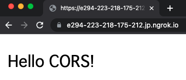
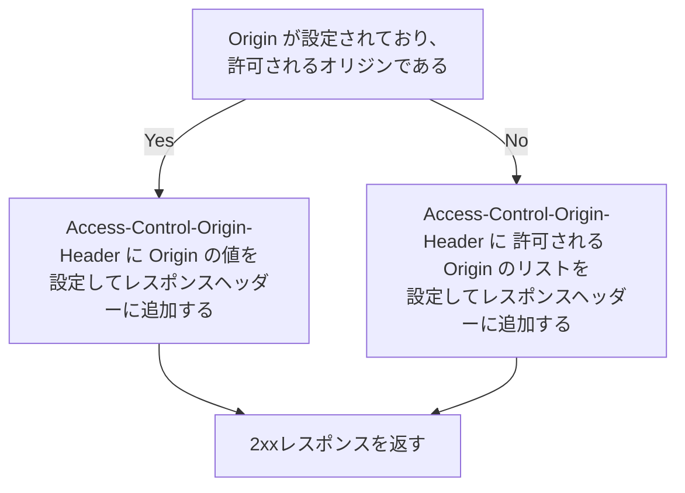

# CORSハンズオン

## 0. 読者へ

このハンズオンでは、ブラウザにおけるCORSの挙動をサーバとなるPythonコードをいじりながら理解していくことを目的としています。このハンズオンでは、CORSについてざっくりとした解説しかしないため、より詳細を知りたい方はMDNの[オリジン間リソース共有 (CORS)](https://developer.mozilla.org/ja/docs/Web/HTTP/CORS)を参照することをお奨めします。

また、誤植や追記、内容の訂正などどんなPRを歓迎しています。説明文に一次情報を添えて変更を下さると嬉しいです。

## 1. CORSの種類

まずは、手を動かす前にCORSの種類についてだけみていきましょう。

Cross-Origin Resource Sharing (CORS) とは、ブラウザ上で動作するスクリプトが、異なるオリジンのリソースをやり取りできるようにするためのプロトコルです。オリジンについては後述します。

CORSは、リクエストの条件によって次のどちらかの動作をします。

- 単純リクエスト(Simple Requests)
- プリフライトリクエスト(Preflight requests)

以下の両方の条件を満たすと単純リクエストとなり、満たさないとプリフライトリクエストとなります。

|条件|項目|
|---|---|
|メソッドが以下の中に含まれる|<ul><li>`GET`</li><li>`HEAD`</li><li>`POST`</li></ul>|
|独自で設定するヘッダーが以下の中に含まれる|<ul><li>`Accept`</li><li>`Accept-Language`</li><li>`Content-Length`</li><li>`Content-Type`(以下の値のみ)<ul><li>`application/x-www-form-urlencoded`</li><li>`multipart/form-data`</li><li>` text/plain`</li></ul></ul>|

さて、いつまでも説明をしていると退屈なので、手を動かしましょう。

## 2. 単純リクエストハンズオン

単純リクエストでは、ブラウザから外部リソースへのリクエストAPIを呼び出した時点でクライアント・サーバ間でデータのやり取りが行われます。

<!-- TODO: もうちょっとわかりやすい図にする -->


このリクエストがどうなっているかを、手元でサーバを立ててブラウザからの通信をみてみます。

以下のコードを`srv.py`として保存しましょう。

```python
from http.server import HTTPServer, SimpleHTTPRequestHandler

class CORSRequestHandler(SimpleHTTPRequestHandler):
    def do_GET(self):
        self.send_response(200)
        self.end_headers()
        self.wfile.write(b'Hello CORS!')
        return

httpd = HTTPServer(('localhost', 8003), CORSRequestHandler)
httpd.serve_forever()
```

保存したら、手元のコンソールから`python3 srv.py`のようにサーバを起動します。まずは動作確認として、そのまま`http://localhost:8003`をブラウザで開いてみましょう。
`Hello CORS!` が表示されれば動作確認完了です。



次に、ブラウザで`https://example.com`を開き、デベロッパーツールを開きます。そのまま以下のコードを、デベロッパーツールに入れて実行しましょう。

```javascript
let url = 'http://localhost:8003'
await fetch(url)
```


いよいよ初めてのCORSリクエストです。結果はどうなるでしょうか？


なんと！初めてのCORSは失敗に終わってしまいました！落ち着いてエラーメッセージを読んでみましょう。

> オリジン 'https://example.com' からの 'http://localhost:8003/' でのfetchへのアクセスは、CORS ポリシーによってブロックされました。要求されたリソースに 'Access-Control-Allow-Origin' ヘッダーが存在しません。opaque responseが必要な場合は、リクエストのmodeに'no-cors'を設定して、CORSを無効にしてリソースをフェッチしてください。

何やらレスポンスに`Access-Control-Allow-Origin`ヘッダーがないため`fetch`へのアクセスがブロックされたとあります。

（fetchメソッドにおいて'no-cors'を設定したopaque responseは、リクエストが失敗したときに空のレスポンスを返すことを意味します。詳しくはMDNの[Fetch API](https://developer.mozilla.org/ja/docs/Web/API/Fetch_API)を参照してください。）

サーバのログを見ると、サーバ側では正常にリクエストが処理されたようです。

```console
127.0.0.1 - - [10/Aug/2022 11:45:14] "GET / HTTP/1.1" 200 -
```

デベロッパーツールのNetworkタブを見るとリクエスト・レスポンスにどのようなヘッダーがあったかを見ることができます。


確かにレスポンスには`Access-Control-Allow-Origin`がありません。MDNでは[`Access-Control-Allow-Origin`](https://developer.mozilla.org/ja/docs/Web/HTTP/Headers/Access-Control-Allow-Origin)が、以下のように説明されます。

> `Access-Control-Allow-Origin`レスポンスヘッダーは、指定されたオリジンからのリクエストを行うコードでレスポンスが共有できるかどうかを示します。

指定されたオリジンというのは、`Origin`リクエストヘッダーの値のことです。画像の例では`https://example.com`ページを開き、外部オリジンの`http://localhost:8003`にリクエストを送信するときに、`Origin`ヘッダーの値は`https://example.com`となっております。詳しくは[Origin (オリジン)](https://developer.mozilla.org/ja/docs/Glossary/Origin)を参照してください。

それでは、サーバに`Access-Control-Allow-Origin`ヘッダーを追加する処理を記述してみましょう。

```diff
     def do_GET(self):
         self.send_response(200)
+        self.send_header('Access-Control-Allow-Origin', '*')
         self.end_headers()
         self.wfile.write(b'Hello CORS!')
         return
```

`*`（ワイルドカード）というのは`Origin`リクエストヘッダーがどのような値であったとしても、ブラウザ側でブロックしなくて良いことを示しています。

修正が完了してサーバを再起動したら、先ほどと同様に`fetch`メソッドを呼び出してみましょう。

```javascript
let url = 'http://localhost:8003'
await fetch(url)
```


初めてのCORSに成功しました！以下のコードで再度実行すれば中身を取り出すこともできます。

```javascript
await (await fetch(url)).text()
```


## 3. アクセスを許可するオリジン

`Access-Control-Allow-Origin`レスポンスヘッダーに`*`を設定し、任意のオリジンからのリクエストを許可していました。この章では、オリジンによってアクセスの許可を出し分けてみましょう。

サーバ側で許可するオリジンであった場合には、`Origin`リクエストヘッダーの値を`Access-Control-Allow-Origin`に設定して返します。

では、サーバ側で許可しないオリジンであった場合はどうすると良いでしょうか？実は、この時の動作は[Cross-Origin Resource Sharing W3C Recommendation 16 January 2014 supserseded 2 June 2020](https://www.w3.org/TR/2020/SPSD-cors-20200602/)及び[The Web Origin Concept](https://datatracker.ietf.org/doc/html/rfc6454)で定義されません。

[What is the expected response to an invalid CORS request?](https://stackoverflow.com/questions/14015118/what-is-the-expected-response-to-an-invalid-cors-request)にあるように、動作には2つの派閥があるようです。

- サーバ側でCORSヘッダーを検査し、レスポンスにエラー（4xx）を返す
- レスポンスは正常に返し、クライアントにCORSヘッダーを検査させる

このハンズオンでは、`Access-Control-Origin-Header`レスポンスヘッダーに許可されるオリジンのリスト（`,`区切り）を設定して返すこととします。この実装は実際にデバッグの際に役立ちますが、副作用を伴うリクエストのレスポンスには向いていません。

想定する動作は次のようになります。



# 参考

- [CORS Tutorial: A Guide to Cross-Origin Resource Sharing](https://auth0.com/blog/cors-tutorial-a-guide-to-cross-origin-resource-sharing/)
- [Python 3: serve the current directory as HTTP while setting CORS headers for XHR debugging](https://gist.github.com/acdha/925e9ffc3d74ad59c3ea)
